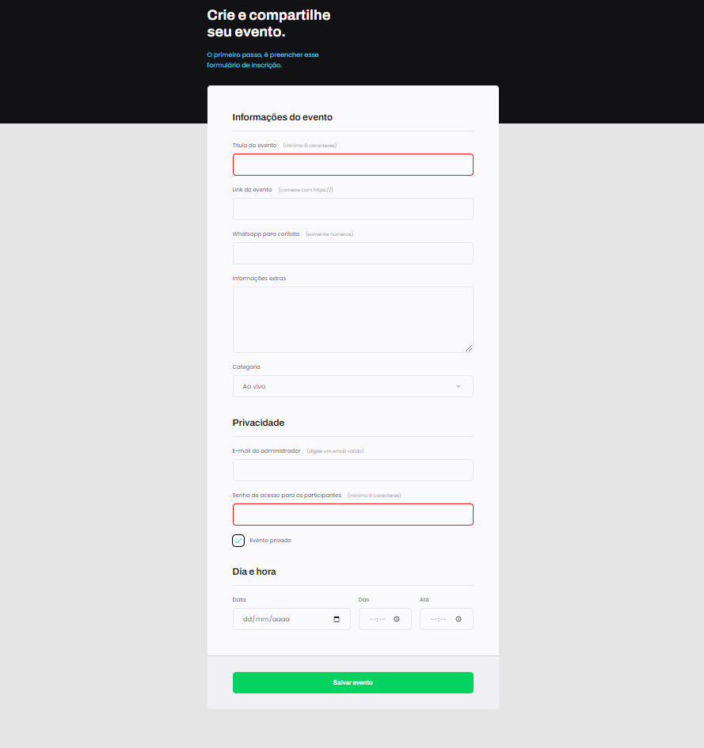

<h1 align="center">
  Formulario-Eventos
</h1>

<h2 align="center" >Descrição do Projeto</h2>

  Formulario-Eventos é o 3° projeto realizado do programa Explorer da Rockeseat.

 

   

     Projeto tem como principal objetivo a criação de um formulário de criação de eventos, com as melhores e mais adequadas pratica de HTML e CSS.
  

   
  
  
  
## :rocket: Tecnologias

Esse projeto foi desenvolvido com as seguintes tecnologias:

✔️ HTML

✔️ CSS

✔️ Flex-box
